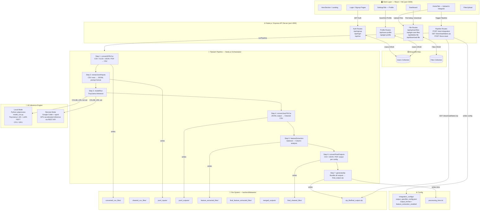

# TabulaX — Project Architecture

> **TabulaX** is an AI-powered smart table integration platform that uses a fine-tuned TinyLlama model to clean, transform, and merge CSV/Excel/JSON/PDF data files. It features a React frontend, a Node.js/Express API server, a MongoDB database, and a Python-based AI inference engine that can run locally or remotely via Google Colab.

---

## High-Level Architecture



---

## Component Breakdown

### 1. Frontend — `tabulax-ui/src/`
| Component | Route | Purpose |
|---|---|---|
| `HeroSection` | `/` | Landing page |
| `About` | `/about` | About page |
| `Support` | `/support` | Support/contact |
| `Login` | `/login` | JWT login form |
| `SignupPage` | `/signup` | User registration |
| `Dashboard` | `/dashboard` | Main app shell with sidebar |
| `HomeTab` | inside Dashboard | File upload + integration trigger |
| `SettingsTab` | inside Dashboard | Profile edit + password change |
| `FilesUpload` | inside Dashboard | View/download/delete uploaded files |
| `Navbar` | global | Top navigation bar |
| `Sidebar` | inside Dashboard | Dashboard side navigation |
| `LogoutModal` | inside Dashboard | Logout confirmation dialog |

### 2. API Server — `tabulax-ui/server/index.js`
- **Runtime**: Node.js + Express (port 4000)
- **Auth**: JWT (jsonwebtoken), password hashing via bcryptjs
- **File Uploads**: Multer (disk storage → `server/uploads/`)
- **Database**: Mongoose → MongoDB Atlas

### 3. Pipeline — `tabulax-ui/server/pipeline/`
| File | Role |
|---|---|
| `pipelineRunner.js` | Orchestrator — runs all 7 steps in sequence |
| `convertAllToCsv.js` | Converts CSV/XLSX/JSON/PDF inputs to CSV |
| `extractJsonlInputs.js` | Converts CSV rows to `.jsonl` prompt format |
| `modelRun.js` | Runs TinyLlama (Colab or local subprocess) |
| `convertJsonlToCsv.js` | Parses model output JSONL → CSV |
| `featureExtraction.js` | Optional: extracts/enriches column features |
| `convertFinalOutputs.js` | Converts cleaned data to the requested output format |
| `generateZip.js` | Zips all output files for download |

### 4. AI Engine — `backend/`
| Component | Description |
|---|---|
| `model_run.py` | Python script: loads TinyLlama-1.1B-Chat + LoRA (PEFT), runs inference on `.jsonl` files |
| `tinyllama_cleaner_05/` | Fine-tuned LoRA adapter weights |
| `datasets/` | Pipeline working directory (inputs/outputs per step) |
| `integration_configs/` | JSON config written before each pipeline run |

### 5. Data Flow

```
User uploads files
        │
        ▼
Multer saves to server/uploads/
        │
        ▼
User clicks "Start Integration"
        │
        ▼
POST /start-integration
        │
   pipelineRunner.js
        │
  ┌─────┴───────────────────────────────────┐
  │  Step 1: Any format → CSV               │
  │  Step 2: CSV rows → JSONL prompts       │
  │  Step 3: TinyLlama cleans each row      │  ◄── Colab GPU or local Python
  │  Step 4: JSONL results → CSV            │
  │  Step 5: Feature extraction (optional)  │
  │  Step 6: Final format conversion        │
  │  Step 7: ZIP all outputs                │
  └─────────────────────────────────────────┘
        │
        ▼
GET /download/latest.zip
        │
        ▼
User downloads cleaned, merged dataset
```

---

## Technology Stack

| Layer | Technology |
|---|---|
| Frontend | React 18, Vite, React Router v6, Tailwind CSS |
| API Server | Node.js, Express 4, Multer, JWT, bcryptjs |
| Database | MongoDB Atlas via Mongoose |
| AI Model | TinyLlama-1.1B-Chat-v1.0 + LoRA PEFT (Python, PyTorch, Transformers) |
| Remote GPU | Google Colab + ngrok tunnel |
| Concurrency | `concurrently` npm package (runs frontend + server together) |

---

## Port Map

| Service | Port |
|---|---|
| React Frontend (Vite) | `3000` |
| Node.js API Server | `4000` |
| Google Colab (ngrok, optional) | dynamic (env: `COLAB_URL`) |
